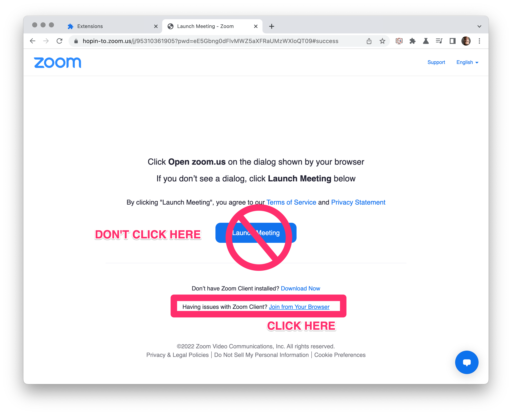
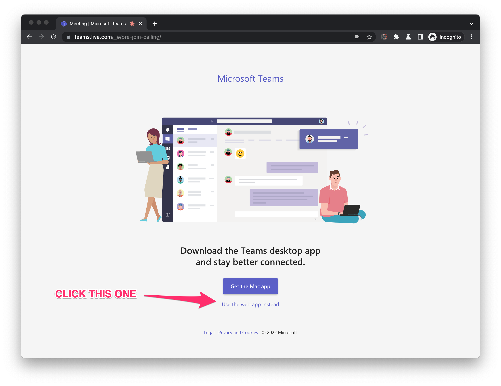
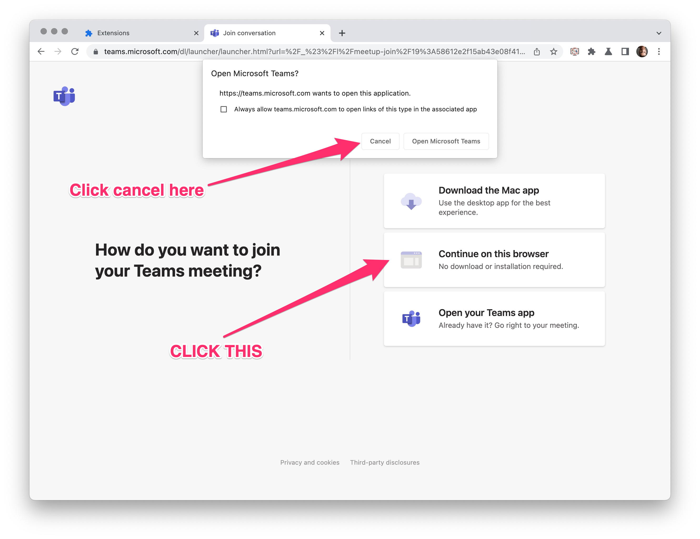
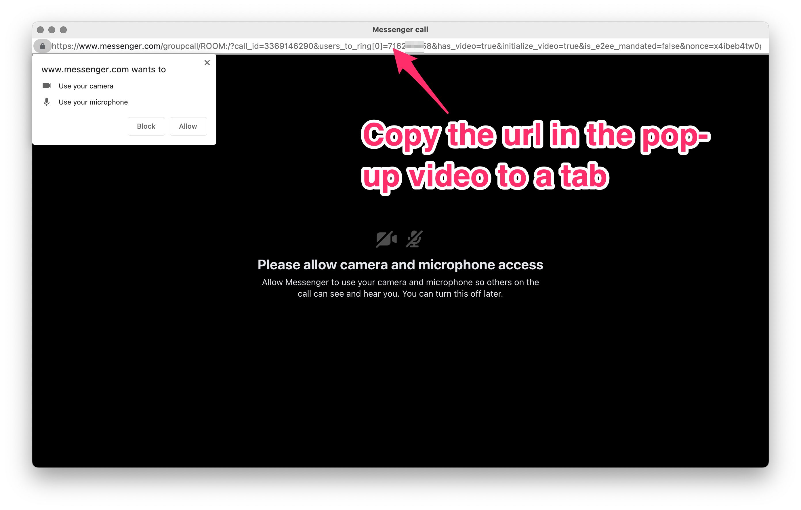

*Click to Watch the demo on YouTube*

### ➡ [Available on the Chrome WebStore](https://chrome.google.com/webstore/detail/bad-connection-simulator/gflankmgolakfdeiponkgmbhbhpdmjlg) ⬅

# Bad Connection Simulator Browser Extension
### Get off of video calls by simulating a fake connection

Stuck on a video call you want to get out and need a good excuse? 
The Bad Connection Simulator Chrome Extension simulates a bad connection with just a click!

* Works with any web-based video calling app
* Easy to use - just install the extension, no other installations required
* 3 levels of impairment - none, moderate, and severe
* Evades low bandwidth adaptation used by video calling apps

## How to Use 🍰
1. [Install the extension from the Chrome WebStore](https://chrome.google.com/webstore/detail/bad-connection-simulator/gflankmgolakfdeiponkgmbhbhpdmjlg)
2. Join your video call
3. Click the Bad Connection Simulator icon and select your impairment level
4. Adjust as needed throughout your call

Verified with Zoom, Google Meet, Microsoft Teams, Facebook Messenger, Google Duo, Jitsi Meet, Whereby.

Make sure to use the web-version of your video calling app.
Bad Connection Simulator also needs to run inside a tab.
See [below](#Specific Video Calling App Guides) for instructions on how to do this for:
* [Zoom](#Using Bad Connection Simulator with Zoom)
* [Microsoft Teams](#Using Bad Connection Simulator with Microsoft Teams)
* [Facebook Messenger](#Using Bad Connection Simulator with Facebook Messenger)

### Three Levels of Impairment

Adjust your impairment depending on your needs:

- 1️⃣  **NONE** - Normal connectivity

- 2️⃣  **MODERATE** - will show some visual impairments and audibly degrade your audio quality. 
Others will notice you are having some connection issues.

- 3️⃣  **SEVERE** - unusable connection with obvious visual artifacts and unusable audio.
Now it is safe to drop off

Star with `moderate` to signal you may have connection issues then switch to `severe` when you’re ready to drop. 
Decrease or stop the impairment at any time.

## For best results

### You have to join from Chrome or Edge!

Bad Connection Simulator only works on Chromium-based Desktop browsers like Chrome or Edge.
Also note, many web calling apps prefer to send you to their native desktop application instead of taking the call from the browser.
Make sure you do not click through to the Desktop app.

### Turn off virtual backgrounds
Don't use the virtual background feature. Usually this will not be altered, so your video will look impaired but the
virtual background won't be.

## How it works ℹ️️

Bad Connection Simulator extension inserts itself after your webcam and microphone streams. Unlike other impairment simulators, everything is contained in the browser and controlled by the extension.
* No installing fake device drivers
* No need to select a special device
* No need to load any external apps

Modern video calling systems are designed to deal with bad connections and will try to adapt to reduce any impairments. 
Bad Connection Simulator applies realistic impairments directly to the source video stream before it is transmitted. 
Video conferencing systems see a normal stream, so they do not make any adjustments while your video and audio come through like garbage!

### Explanation for Nerds 🤓

Bad Connection Simulator makes use of [WebRTC Insertable Streams](https://web.dev/mediastreamtrack-insertable-media-processing/). 
After a [getUserMedia](https://developer.mozilla.org/en-US/docs/Web/API/MediaDevices/getUserMedia) call, the source streams 
are routed through [WebCodecs](https://www.w3.org/TR/webcodecs/) where the stream is re-encoded with simulated packet loss and latency. 
Then the stream is passed to the video calling app where it is displayed and can be passed to a `RTCPeerConnection`.

# &nbsp;&nbsp;&nbsp;&nbsp;&nbsp; ➡ [Install from the Chrome WebStore](https://chrome.google.com/webstore/detail/bad-connection-simulator/gflankmgolakfdeiponkgmbhbhpdmjlg) ⬅

## Specific Video Calling App Guides

See below for specific guides on how to use Bad Connection Simulator with various Video Calling Applications.

### Using Bad Connection Simulator with Zoom

Zoom always tries to force you to their desktop application. If prompted, refuse any options to download or launch the app
and look for the "Join from your Browser" link. 
Sometimes you need to hit cancel several times before the "Join from your Browser" link appears.

Note: some Zoom administrators [disable the option](https://support.zoom.us/hc/en-us/articles/115005666383-Enabling-or-disabling-Show-a-Join-from-your-browser-link)
to join from the web.

### Using Bad Connection Simulator with Microsoft Teams
Microsoft encourages you to start teams with their Desktop application. 
Make sure to click on "use the web app instead" or "continue on this browser".

### Using Bad Connection Simulator with Facebook Messenger

When making calls with messenger on Facebook.com or Messenger.com, the app will load the call in a new window 
that Bad Connection Simulator cannot access. To circumvent this, just copy the URL bar contents to a new tab.
The URL will look something like `https://www.messenger.com/groupcall/ROOM:2540247696324974/?call_id=2463456847`.
Just copy that to a new tab in your browser and you can have your Messenger call as usual with access to the extension.

